- [1. Schritt-für-Schritt-Anleitung (HowTo: Importiere den Jahresspielplan deiner Fussball-Mannschaft als Termine in die Spielerplus-App)](#1-schritt-für-schritt-anleitung-howto-importiere-den-jahresspielplan-deiner-fussball-mannschaft-als-termine-in-die-spielerplus-app)
  - [Wie kommst du von hier nach ...](#wie-kommst-du-von-hier-nach-)
  - [... hier](#-hier)
  - [... bzw. hier](#-bzw-hier)
  - [1.1. Warum ist es notwendig Excel zu verwenden?](#11-warum-ist-es-notwendig-excel-zu-verwenden)
  - [1.2. Import-Funktion nur über Web-UI - nicht per App möglich](#12-import-funktion-nur-über-web-ui---nicht-per-app-möglich)
- [2. Ablauf des Datenimports in Spielerplus](#2-ablauf-des-datenimports-in-spielerplus)
  - [2.1. XLSX-Vorlage von Spielerplus herunterladen](#21-xlsx-vorlage-von-spielerplus-herunterladen)
    - [2.1.1. URL öffnen:](#211-url-öffnen)
    - [2.1.2. Zu "Spielplan importieren" navigieren](#212-zu-spielplan-importieren-navigieren)
  - [2.2. XLSX-Vorlage anpassen/vorbereiten](#22-xlsx-vorlage-anpassenvorbereiten)
  - [2.3. Spielplan-Daten deiner Mannschaft von Fussball.de-Webseite in Excel übernehmen](#23-spielplan-daten-deiner-mannschaft-von-fussballde-webseite-in-excel-übernehmen)
    - [2.3.1. Alle Spiele kopieren](#231-alle-spiele-kopieren)
    - [2.3.2. Einfügen in Zelle A2 im Tabellenblatt "Import-Helper"](#232-einfügen-in-zelle-a2-im-tabellenblatt-import-helper)
    - [2.3.3. Alles Kopieren und in neues Tabellenblatt einfügen](#233-alles-kopieren-und-in-neues-tabellenblatt-einfügen)
    - [2.3.4. Einfügen in leeres Tabellenblatt \>\> STRG drücken + E](#234-einfügen-in-leeres-tabellenblatt--strg-drücken--e)
    - [2.3.5. Werte und Quell-Formatierung auswählen](#235-werte-und-quell-formatierung-auswählen)
    - [2.3.6. Dann sollte es so aussehen](#236-dann-sollte-es-so-aussehen)
    - [2.3.7. Jetzt müssen noch die Leerzeilen entfernt werden](#237-jetzt-müssen-noch-die-leerzeilen-entfernt-werden)
      - [2.3.7.1. Spalte B markieren](#2371-spalte-b-markieren)
      - [2.3.7.2. STRG+G (Gehe Zu)](#2372-strgg-gehe-zu)
      - [2.3.7.3. ALT+I+R (Inhalte \>\> Leerzeilen) \> Ok](#2373-altir-inhalte--leerzeilen--ok)
      - [2.3.7.4. STRG + "-" (Löschen der Zeilen)](#2374-strg----löschen-der-zeilen)
      - [2.3.7.5. Dann sieht es so aus](#2375-dann-sieht-es-so-aus)
  - [2.4. XLSX-Vorlage in Spielerplus hochladen](#24-xlsx-vorlage-in-spielerplus-hochladen)
- [3. Beschreibung der verwendeten Excel-Formeln](#3-beschreibung-der-verwendeten-excel-formeln)
  - [3.1. Rechtliche Betrachtung](#31-rechtliche-betrachtung)


# 1. Schritt-für-Schritt-Anleitung (HowTo: Importiere den Jahresspielplan deiner Fussball-Mannschaft als Termine in die Spielerplus-App)
Im folgenden erkläre ich dir, wie du deinen Spielplan mit allen Spielen deiner Mannschaft von Fussball.de unter zu Hilfenahme von Excel als Termine in deinen Spielerplus-Kalender importierst. 

## Wie kommst du von hier nach ... 
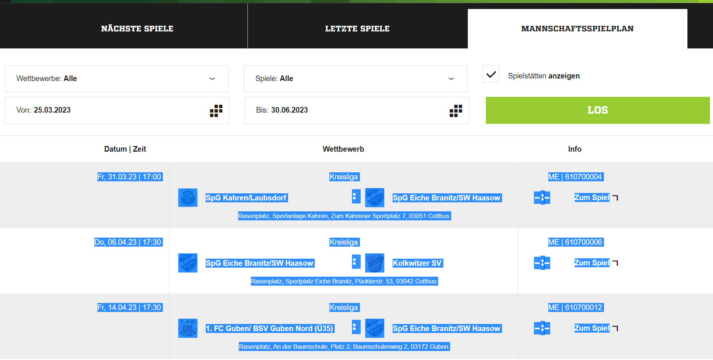

## ... hier
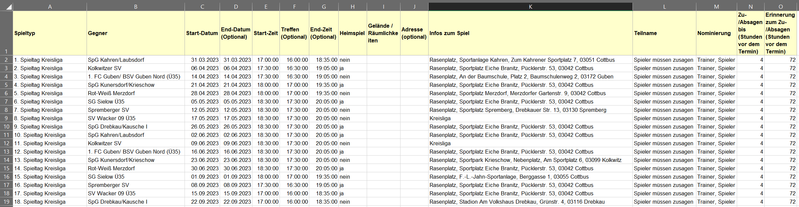

## ... bzw. hier
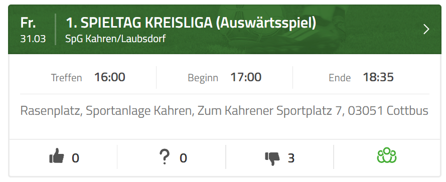


## 1.1. Warum ist es notwendig Excel zu verwenden?
Zum aktuellen Zeitpunkt gibt es keine Fussball.de-Rest-API, welche man verwenden könnte, um eine Export/Import-Schnittstelle von Fussball.de nach Spielerplus.de zu entwickeln. Es gibt ein paar eine Widgets, die jedoch nicht als Kalender-import/export verwendet werden können. Es gibt jedoch eine Import-Funktion in Spielerplus, welche auf Basis von CSV-Dateien basiert. Somit können Daten in Excel bereitgestellt werden und per Import-Funktion in Spielerplus überführt werden.

Daher zeige ich dir hier, wie du in 10 Minuten deinen kompletten Spielplan von Fussball.de als Termine in deine Spielerplus-App bekommst.

## 1.2. Import-Funktion nur über Web-UI - nicht per App möglich
Aktuell kannst du die Import-Funktion nur am PC, Laptop bzw. über die Web-URL in einem Browser nutzen. Innerhalb der App gibt es die Import-Funktion leider nicht.

# 2. Ablauf des Datenimports in Spielerplus
```yaml
# Falls die Excelvorlage hier aus dem Repo verwendet wird, kannst du mit dem Punkt "Spielplan-Daten deiner Mannschaft von Fussball.de-Webseite in Excel übernehmen" fortfahren
```

- XLSX-Vorlage von Spielerplus herunterladen (besser, die Vorlage hier aus dem Git-Repo verwenden)
- XLSX-Vorlage anpassen/vorbereiten (Kann übersprungen werden, wenn diese Vorlage hier verwendet wird)
- Spielplan-Daten deiner Mannschaft von Fussball.de-Webseite in Excel übernehmen
- XLSX-Vorlage in Spielerplus hochladen

## 2.1. XLSX-Vorlage von Spielerplus herunterladen
### 2.1.1. URL öffnen: 
```
https://www.spielerplus.de/
```
### 2.1.2. Zu "Spielplan importieren" navigieren
```yaml
Termine > Termin erstellen > Spielplan importieren
```
Du kannst bis zu 100 Spiele auf einmal aus einer Datei importieren. Um dir den Import zu erleichtern, haben wir eine Beispieldatei mit voreingestellten Feldformaten bereitgestellt. Diese findest du hier: `XLSX`

https://assets.spielerplus.de/assets/2212e06085fb302abda61a3c28832fc63655/downloads/examples/games_de.xlsx

## 2.2. XLSX-Vorlage anpassen/vorbereiten
```yaml
# Inhalt aus Excel-Vorlage herauskopieren und in neue leere Excel-Tabelle einfügen
# 8 Spalten einfügen A-H, so dass "Spielertyp" in "Spalte I" steht
# Excel-Formeln in Zeile 2 so eintragen, wie unten beschrieben oder Vorlage verwenden
```
## 2.3. Spielplan-Daten deiner Mannschaft von Fussball.de-Webseite in Excel übernehmen
### 2.3.1. Alle Spiele kopieren
Navigiere zu deinem Mannschaftsspielplan und lasse dir alle Spiele anzeigen
https://www.fussball.de/mannschaft/spg-eiche-branitz-sw-haasow-sv-eiche-branitz-brandenburg/-/saison/2223/team-id/02F76QNHU4000000VS5489B1VU7L28SU#!/


### 2.3.2. Einfügen in Zelle A2 im Tabellenblatt "Import-Helper"
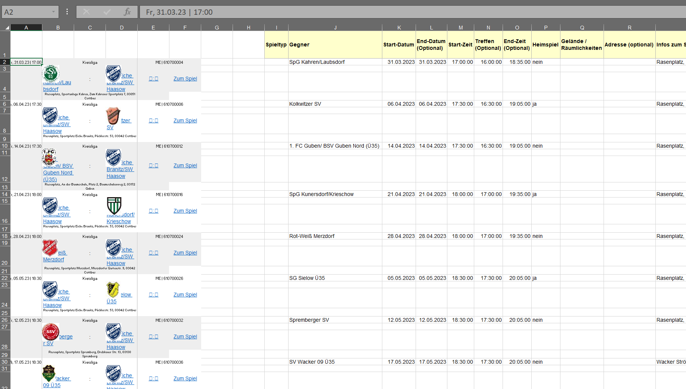

### 2.3.3. Alles Kopieren und in neues Tabellenblatt einfügen
Wenn alle Spiele in der Vorlage eingefügt sind, dann markiere alle eingefügten Spiele. Zelle I1:W68 > Kopieren und in ein neues Tabellenblatt einfügen > "Werte und Quell-Formatierung beim Einfügen auswählen ("STRG" und danach "E")"
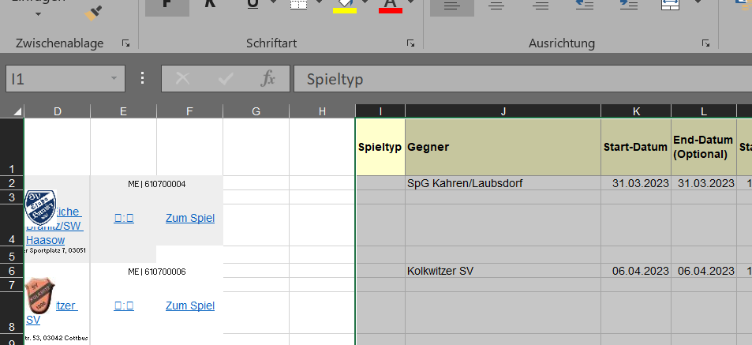
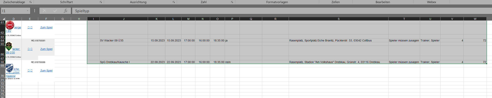

### 2.3.4. Einfügen in leeres Tabellenblatt >> STRG drücken + E
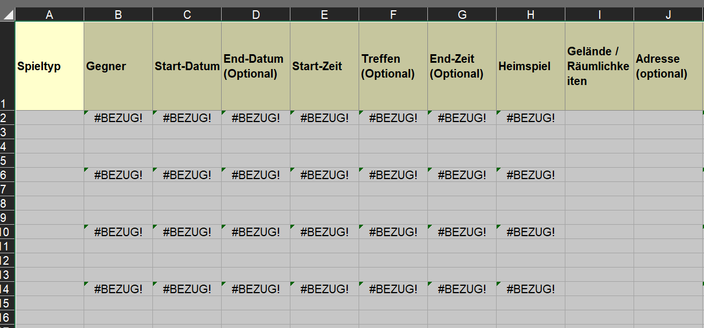

### 2.3.5. Werte und Quell-Formatierung auswählen
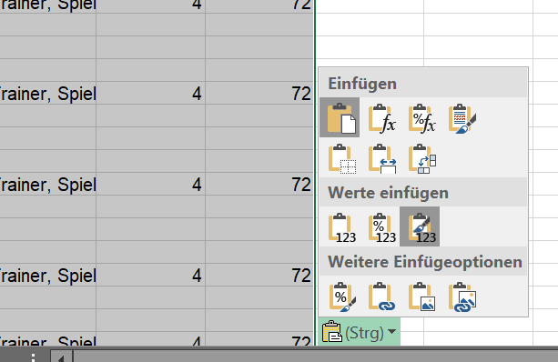

### 2.3.6. Dann sollte es so aussehen
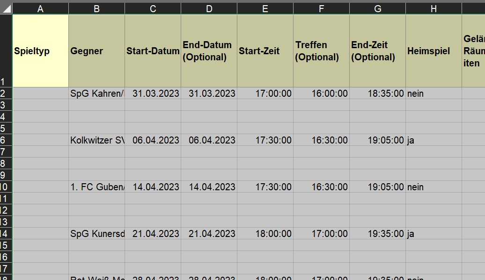

### 2.3.7. Jetzt müssen noch die Leerzeilen entfernt werden
#### 2.3.7.1. Spalte B markieren
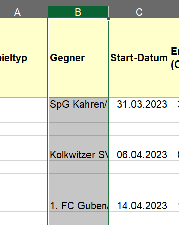

#### 2.3.7.2. STRG+G (Gehe Zu)
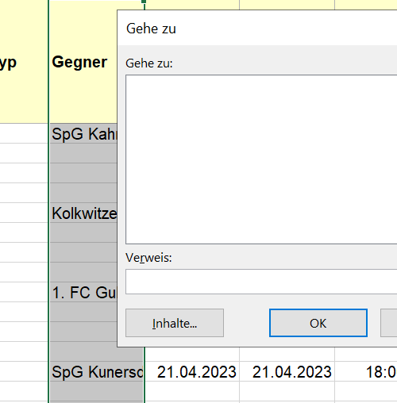

#### 2.3.7.3. ALT+I+R (Inhalte >> Leerzeilen) > Ok
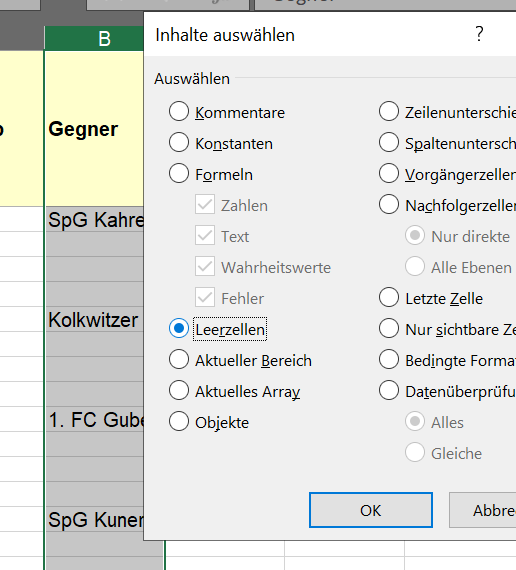

#### 2.3.7.4. STRG + "-" (Löschen der Zeilen)
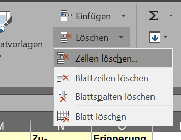

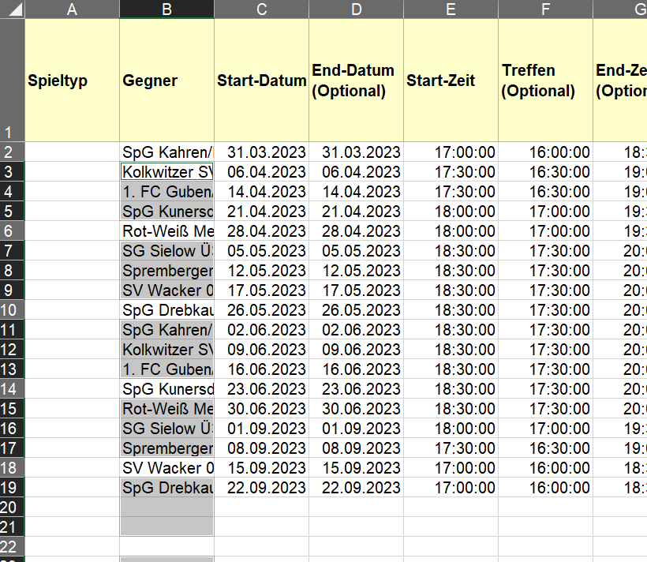

#### 2.3.7.5. Dann sieht es so aus
Spieltyp eintragen. Hier kann ein beliebiger Text rein, z.B.: 
`"1. SPIELTAG KREISLIGA"` und dann Zeile nach unten ziehen zum vervollständigen

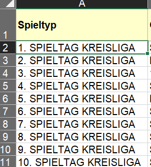


## 2.4. XLSX-Vorlage in Spielerplus hochladen

# 3. Beschreibung der verwendeten Excel-Formeln

```yaml
# Excel-Formeln in den Spalten
Spalte J (Gegner): =WENN(B4="SpG Eiche Branitz/​SW Haasow";D4;B4)
    # Kommentar zu Spalte J: Hier trägst du einfach deine Mannschaft (SpG Eiche Branitz/​SW Haasow) ein, der du angehörst
    # Dies ist eine einfache Wenn/Dann-Funktion
    # Wenn der Name in Zelle B4 mit dem deiner Mannschaft übereinstimmt, dann trage bitte die andere Mannschaft in Spalte J ein, denn das ist dein Gegner
    # Bei Heimspielen steht dein Gegner immer in Spalte D (Die Auswärtsmannschaft)
    # Bei Auswärtsspielen steht dein Gegner immer in Spalte B (Die Heimmannschaft)

Spalte K (Start-Datum): =DATWERT(TEIL(A2;4;9))
    # Kommentar zu Spalte K: Die Funktion DATWERT ermittelt in Kombination mit der TEIL-Funktion das Datum (31.03.23) aus der Zeichenkette (Fr, 31.03.23 | 17:00) in Zelle A2

Spalte L End-Datum (Optional): =K2
    # Kommentar zu Spalte L: Bei einem Fussballspiel ist das Enddatum meisten gleich dem Start-Datum. Dadurch übernehmen wir mit =K2 den Wert aus der Spalte K vom Start-Datum

Spalte M Start-Zeit: =ZEITWERT(GLÄTTEN(TEIL(A2;16;9)))
    # Kommentar zu Spalte M: Wir müssen hier Uhrzeit-Teil an dem String (Fr, 31.03.23 | 17:00) ermitteln und ins Format hh:mm:ss konvertieren. Das übernimmt die Funktion ZEITWERT
    # Die Glätten-Funktion entfernt eventuelle Leerzeichen vor oder nach der Uhrzeit, welche mit der TEIL-Funktion ermittelt wird.

Spalte N Treffen: =M2-"01:00:00"
    # Kommentar zu Spalte N: Der Treffpunkt soll 1h vor dem Spielbeginn sein. Daher ziehen wir eine Stunde vom Zeitwert also der "START-ZEIT" ab. 
    # Ergebnis 17:00:00
    # Startzeit 18:00:00 minus eine Stunde vor Treffen 01:00:00 = 17:00:00 Uhr
    # Hier könnt ihr selber festlegen, wie zeitig ihr euch vor dem Spielbeginn als Mannschaft trefft


Spalte O End-Zeit: =M2+"01:35:00"
    # Kommentar zu Spalte O: Das Spielende ermittelt sich aus dem Zeitpunkt des Spielbeginns + 40 Minuten erste Halbzeit + 15 Minuten Pause + 40 Minuten in der zweiten Halbzeit
    # 95 Minuten = 1h 35m = 01:35:00
    # Auch hier könnt ihr individuell eure Spiellänge festlegende und damit den End-Zeitpunkt berechnen

Spalte P Heimspiel: =WENN(B4="SpG Eiche Branitz/​SW Haasow";"ja";"nein")
    # Kommentar zu Spalte P: Ob es sich um ein Heimspiel oder Auswärtsspiel handelt ermittelt sich leicht. Die Linke Mannschaft (Spalte B) ist die Heimmannschaft und demzufolge in Spalte D steht der Name der Auswärtsmannschaft
    # Hier wird dein Mannschaftsname mit dem Wert in Zelle B4 abgeglichen.
    # Bei einer Übereinstimmung ist es ein Heimspiel, also "ja"
    # Bei keiner Übereinstimmung ist es ein Auswärtsspiel, also "nein"

Spalte Q Gelände / Räumlichkeiten: 
    # Diese Werte sind bei uns von Fussball.de nicht gepflegt, also bleiben die Felder leer

Spalte R Adresse (optional):
    # Die Adressen von Fussball.de nach Spielerplus zu konvertieren stellt zum jetzigen Zeitpunkt für mich eine absolute Herausforderung dar, weil die Importfunktion die Adressen irgendwie abgleicht, ob sie existieren. Leider funktioniert es bei mir überhaupt nicht, dass ich die Werte 1:1 von Fussball.de nach Spielerplus über die Importfunktion übertragen konnte.

Spalte S Infos zum Spiel: =B5
    # Ich nutze dieses Feld um die "Adressen" (Zelle B5) im Info-Feld des Termins anzeigen zu lassen. Somit kann ich jeden beliebigen Ort eintragen.
    # Achtung: Sonderzeichen weglassen! Selbst Anführungszeichen werden nicht erlaubt.

Spalte T Teilname: Spieler müssen zusagen
    # Den Wert musst du so übernehmen, wenn du erzwingen möchtest, dass deine Spiele zusagen müssen

Spalte U Nominierung: 
    # Hier kannst du festlegen, welche Spielerplus-Rolle alles nominiert werden darf.
    # Trainer, Spieler

Spalte V Zu-/Absagen bis (Stunden vor dem Termin):
    # Dieser Wert erklärt sich von selbst und muss als "Integer (Ganzzahl)" eingetragen werden

Spalte W Erinnerung zum Zu-/Absagen:
    # Dieser Wert erklärt sich auch von selbst und muss als "Integer (Ganzzahl)" eingetragen werden
    # Unsere Spieler werden 3 Tage vor dem Spiel erinnert in der App zum Spiel zu- oder abzusagen
```

## 3.1. Rechtliche Betrachtung
- Ich zeige hier ausschließlich eine technische Möglichkeit und distanziere mich von der tatsächlichen Anwendung
- Beim Kopieren von Inhalten fremder Webseiten ohne deren Zustimmung, befindet man sich mit Sicherheit in der Grauzone. Daher gilt folgende Annahme. 
- Du bist die Person, die im dfbnet die Daten für deinen Verein verwaltet und die Datensätze mit Informationen anreichert. Daher wird es dir gestattet sein
- Allerdings handelt es sich bei Fussball.de um einen wichtigen Dienst, welcher zum Spielbetrieb von tausenden von Mannschaften in Deutschland verwendet wird und es nicht im Sinne des Erfinders liegt, dass jede Mannschaft seine eigenen Daten erhebt und mit Fussball.de abgleicht
- Bei dieser Anleitung handelt es sich um eine Erleichterung um bereits vorhandene Daten ohne Copy&Paste jedes einzelnen Eintrags von A nach B zu übertragen.
- Es wird keine Automatismus, weder von Spielerplus, noch von Fussball.de angeboten.